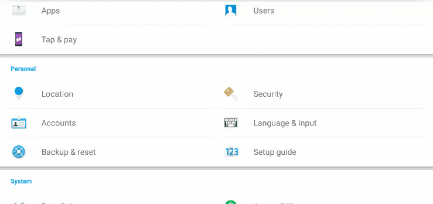
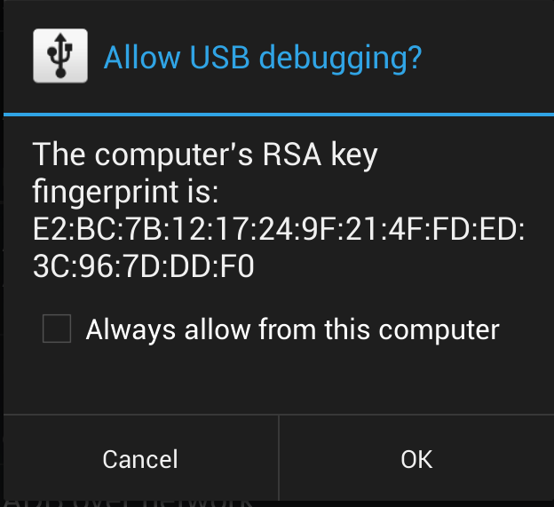

# FireLink


**Status**: Beta Stage 3

**What is it?** This is a chrome extension for sharing links immediately to the
FireLink app.

**How do I set it up?** You can sign up at https://postmail.invotes.com/ and
then use that API key for the chrome extension setup. After getting the API
key, install FireLink.

1. Obtain the API key from https://postmail.invotes.com/

2. Open your git folder and open git bash and enter the following:

```sh
git clone https://github.com/bartektenDev/FireLink.git
```

3. Now open chrome and copy and paste the following:

```sh
chrome://extensions/
```
4. Click **Load Unpacked** then find the FireLink folder in your git folder and
select it.

5. Congratulations you installed the FireLink extension, but now you gotta install
the app. Now click on the folder path and type in cmd and press enter. Command
Prompt should have popped up. Now enter the following:

```sh
cd android
```

6. Now connect your android device and make sure that android debugging is enable
if you go into developer options. For more info <a href="https://developer.android.com/studio/debug/dev-options">click here</a>.
The following gif below show you where to go for most devices.



7. Now unlock your device and if a popup comes up like the picture below, just
tap "Always allow for this computer" and tap "Ok".



8. In Command Prompt now enter the following:

```sh
adb install firelist.apk
```

9. Then it should install successfully and if you have any issues look them up.
It's with adb not FireLink.

10. Open the FireLink application and enter your Gmail credentials. The application
is open source to ensure that no data is being stolen from the users. This also
allows for more possibilities and improvements with the feedback I receive!
