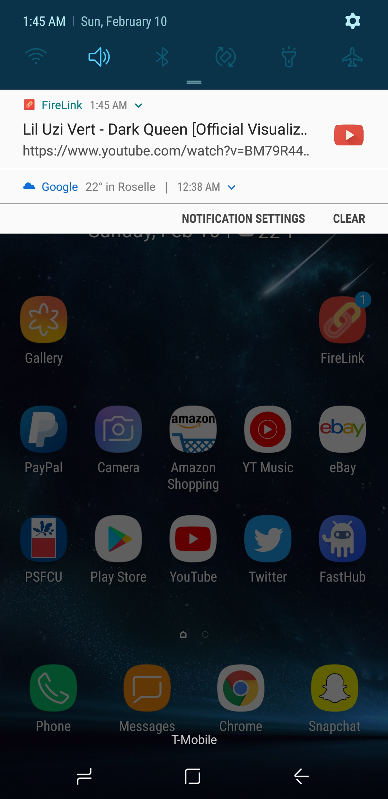

# FireLink 

**Status**: Beta Stage 7
There are a total of 9 steps. 7 out of 9 work.

**What is it?** This is a chrome extension for sharing links immediately to your mobile device!

**Preview Demo**

Step 1. Click on the FireLink extension
:-------------------------:


Step 2. Click send (so fast less than 2s)
:-------------------------:


Step 3. Recieve Notification       |  Step 4. Open Link (detects what the link is to which app!)
:-------------------------:|:-------------------------:
  |  

**How to set it up yourself!** 

1. Open your git folder and open git bash and enter the following:

```sh
git clone https://github.com/bartektenDev/FireLink.git
```

2. Now open chrome and copy and paste the following:

```sh
chrome://extensions/
```
3. Click **Load Unpacked** then find the FireLink folder in your git folder and
select it.

4. Congrats! You have the FireLink extension added. Make sure to now download FireLink
for Windows/Mac (linux is supported too) and launch the setup file by cloning
**FireLink-WinMac** to another directory. Here's what that should look like.

```sh
git clone https://github.com/bartektenDev/FireLink-WinMac
```

5. Using terminal cd (change directory) into that directory. 

```sh
cd FireLink-WinMac
```

6. And the following command should be:

```sh
npm start
```

7. A window will pop up. Do not close this window. Follow the steps. Click
the copy button and paste the URL in your default web browser (Safari, Chrome, Opera).
Once you land on that page, please enable notifications when you are asked
for permission and if the popup didn't come up, you should see a button that
will allow you to force ask for notification permissions. Then once you've completed
this step, please open the FireLink application on your mobile device and 
click the three dots in the top right corner and click **'Register New Device'**.
Scan your PC Key with your Mobile device. You will be asked to send a friend
request to the PC. (This is to ensure safety for all our users and to stop
people from possible hi-jacking of other people's PC keys. So if you want a
new key (token) for your PC to register, all you need to do is press the
generate new key (token) button. This was implemented for cyber safety!

**DO NOT CLICK ON OTHER TABS NOW.** 
When you are going to send the friend request to the computer, keep that
page open otherwise the registration process WILL fail. Again another security
feature implemented :) . On the computer you will see a friend request from
hopefully, your mobile device, not someone else's if done correctly.

8. Accept the friend request and select, Save this device! That's it,
now you and your PC can communicate back and forth to share links! You
can close the tab with the FireLink setup () and you can close the 
FireLink software that's running, but **DO NOT QUIT IT FROM RUNNING**.
If you quit the application from running then your PC will **NOT** recieve
any notifications if links are shared from the mobile device, but you
will be able to send notifications from your PC to your mobile device 
without a problem.

9. Final step to see if all is working well, go to any website, but the
URL must begin with either http:// or https:// . Then click on the FireLink
extension in your main web browser and click **send**. DING! You got a notification
from your PC onto your mobile device. Enjoy! I wouldn't mind a donation
for a cup of coffee :)


**What's being worked on?**
- [ ] Working on making an easy set up for Windows/Mac and Android/iOS. 
- [X] Setup localhost on port 5000 the token retriever
- [X] QR Scanner in FireLink app
- [X] Read QR Code in FireLink app
- [ ] Send friend request to QR Code from setup on main PC
- [ ] Retrieve friend request from FireLink app
- [ ] Read FROM token in the notification from the app. Both parties need to accept the
friend request otherwise if it is denied from the computer setup, then the FireLink
application will cancel and not allow the request to be made or completed.
